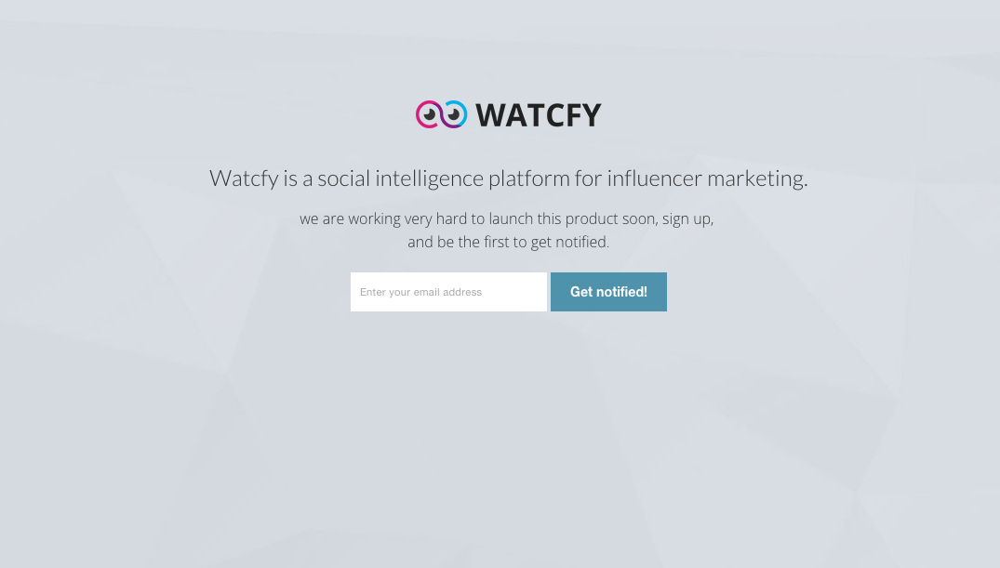

##Watcfy Launch Page
####Quick setup a coming soon page
This package helps you quickly setup a coming soon or beta page with email signup option. 

now added a hook for slack, whenever users signup on your input box it will send a message on your slack channel, change the url in launchCollection.js

```js
var url = "add your hook url";
````

Adding your own text by changing routes from default page:

```js
Router.route('/', {
	'name':"watcfyLaunch",
	'template':'watcfyLaunch',
    'onBeforeAction': function () {
        // define logo,
        WatcfyLaunch.options = {
            "logo": "img/logo.png", // add your own logo
            "title": "Watcfy is a social intelligence platform for influencer marketing.", // title text
            "text": "we are working very hard to launch this product soon, sign up and be the first to get notified.", // text
            "theme": "dark"
        };
        this.next();
    }
});
````

